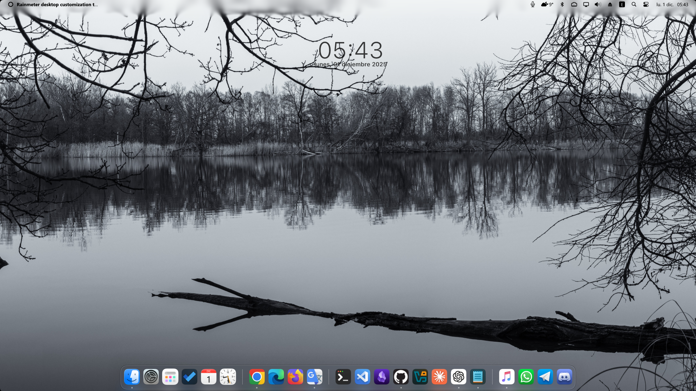

# OSX Clock
Rainmeter clock widget like OSX

## Screenshots

## Configure and customize
In the main file, you can change the following properties:
- Time color
- Time size
- Date color
- Date size
- Date language

> After changing the values ​​in the `[Variables]` section, save the file and refresh the skin in the Rainmeter app.
